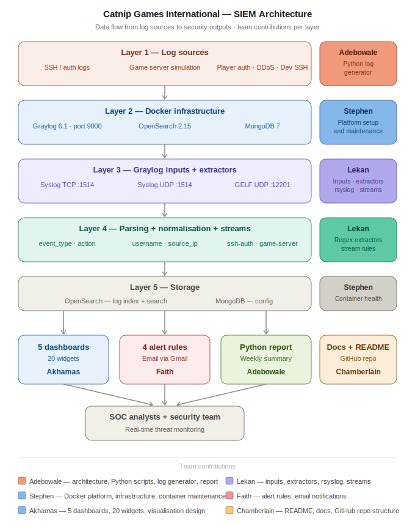

# Catnip Games International — Security Monitoring SIEM

[](https://graylog.org)
[](https://opensearch.org)
[](https://mongodb.com)
[](https://docker.com)
[](https://python.org)

---

## Assessment Context

This project was built for the **Cyber Security Automation** module at the University of Roehampton.

**Work Role:** DCWF 511 — Cyber Defense Analyst

**Competency:** Uses data collected from cyber defense tools to analyse events for the purposes of mitigating threats.

**Assessment:** In-lab team demonstration with individual Q&A

**The brief asked us to:**
- Select a real-world security scenario requiring automated monitoring
- Design and deploy a SIEM solution addressing that scenario
- Demonstrate log ingestion, parsing, stream routing, dashboards, and alerting
- Show evidence of automation beyond manual configuration
- Reflect critically on design decisions, limitations, and mitigations

**Our Solution:** We built a fully operational Graylog-based SIEM for a fictional gaming company called Catnip Games International, simulating the security infrastructure of a company with 300 game servers, a player authentication system, and a developer environment, all of which were compromised or unmonitored during the company's beta phase.

---

## The Problem We Solved

During Catnip Games' beta testing phase, three critical security incidents went undetected for several days:

- Unauthorised access attempts to player data
- Potential DDoS attacks targeting game servers
- Suspicious activity in development environments

The root cause was fragmented logging and manual monitoring. Logs lived on individual servers with no central visibility. There were no automated alerts. Nobody was watching.

This project builds the solution — a centralised SIEM that collects, parses, visualises, and alerts on security events across the entire Catnip Games infrastructure in real time.

---

## What This System Does

- Collects real SSH authentication logs from Linux servers via rsyslog
- Simulates game server, player auth, DDoS, and dev SSH log events via Python
- Parses raw log messages into structured searchable fields using extractors
- Routes events into logical streams for targeted analysis and alerting
- Displays real-time security data across 5 purpose-built dashboards with 20 widgets
- Detects threats automatically using 4 correlation alert rules
- Sends email notifications when attacks are detected via Gmail SMTP
- Generates weekly automated security reports via Python API queries

---

## Architecture Diagram



The diagram above shows the complete data flow — from log sources on the left, through Graylog inputs, extractors, and stream routing, into OpenSearch storage, and out through dashboards, alerts, and automated reports to the SOC team. Each layer is labelled with the team member responsible for that component.

---

## Tech Stack

| Component | Version | Purpose |
|---|---|---|
| Graylog | 6.1 | SIEM brain, web UI, alerting |
| OpenSearch | 2.15.0 | Log storage and full-text search |
| MongoDB | 7 | Graylog configuration storage |
| Docker Compose | v2+ | Container orchestration |
| Python | 3.x | Log simulation and report generation |
| rsyslog | built-in | Real SSH log forwarding |

### Why these specific versions

**Graylog 6.1 not 7.x** — Graylog 7.x had not been validated against OpenSearch 2.15 at time of deployment. Stability and documented compatibility were prioritised over running the latest release.

**OpenSearch not Elasticsearch** — Elastic changed its licence to proprietary in 2021. OpenSearch is the fully open source fork and is officially supported by Graylog 6.x.

**MongoDB 7** — Current stable release officially supported by Graylog 6.x. MongoDB stores Graylog configuration only — not the actual log data.

---

## Repository Structure

```
Catnip-Siem/
├── docker-compose.yml          # Full stack definition
├── .env.example                # Environment variable template
├── .gitignore                  # Excludes secrets and generated files
├── bootstrap.sh                # One-command setup — Mac, Linux, WSL
├── bootstrap.ps1               # One-command setup — Windows PowerShell
├── bootstrap.bat               # One-command setup — Windows CMD
├── scripts/
│   ├── log_generator.py        # Simulates Catnip Games infrastructure
│   └── report_generator.py     # Automated weekly security report
├── content-packs/
│   └── catnip-siem-pack.json   # Full Graylog config — streams, alerts,
│                               # dashboards, extractors, notifications
├── assets/
│   └── catnip-siem-architecture.svg
└── docs/
    ├── platform-setup.md       # Infrastructure and Docker setup (Stephen)
    ├── log-ingestion.md        # Inputs, extractors, streams (Lekan)
    ├── alert-rules.md          # Alert definitions and remediation (Faith)
    └── dashboards.md           # Dashboard design and widget reference (Akhamas)
```

---

## Prerequisites

Before you begin, make sure you have the following installed:

| Tool | Purpose | Download |
|---|---|---|
| Docker Desktop | Runs all containers | [docker.com](https://docker.com) |
| Git | Clones the repository | [git-scm.com](https://git-scm.com) |
| Python 3.x | Runs the scripts | [python.org](https://python.org) |

> **Note for Windows users:** You also need WSL (Windows Subsystem for Linux). Open PowerShell as administrator and run:
> ```
> wsl --install
> ```
> Restart your computer after installation.

---

## Quick Start — Fully Automated Setup

The bootstrap scripts handle everything automatically — Docker startup, content pack installation (restoring all streams, dashboards, alert rules, and extractors), Python dependencies, and the log generator. One command and you have a fully running SIEM.

### Step 1 — Clone the repository

```bash
git clone https://github.com/Captnfresh/Catnip-Siem.git
cd Catnip-Siem
```

### Step 2 — Create your environment file

```bash
cp .env.example .env
```

Open `.env` and fill in the values shared privately with the team via WhatsApp:

```
GRAYLOG_PASSWORD_SECRET=
GRAYLOG_ROOT_PASSWORD_SHA2=
GRAYLOG_HTTP_EXTERNAL_URI=http://localhost:9000/
OPENSEARCH_ADMIN_PASSWORD=
SMTP_HOST=smtp.gmail.com
SMTP_PORT=587
SMTP_USER=
SMTP_PASSWORD=
```

### Step 3 — Run the bootstrap script

**Mac / Linux / WSL:**
```bash
chmod +x bootstrap.sh
./bootstrap.sh
```

**Windows PowerShell:**
```powershell
.\bootstrap.ps1
```

**Windows CMD:**
```
bootstrap.bat
```

The bootstrap script automatically:
- Detects your operating system
- Sets the required OpenSearch kernel setting on Linux/WSL (skipped on Mac/Windows)
- Starts all three Docker containers
- Waits for Graylog to become healthy
- Uploads and installs the content pack — restoring all inputs, extractors, streams, dashboards, alert rules, and email notifications
- Installs Python dependencies
- Starts the log generator in the background

**Expected output:**

```
=============================================================
   Catnip Games International — SIEM Bootstrap
=============================================================

[1/7] Detecting operating system...
[OK] WSL (Windows Subsystem for Linux) detected

[2/7] Checking dependencies...
[OK] Docker found: Docker version 27.x
[OK] Docker Compose found
[OK] Python3 found: Python 3.12.x

[3/7] Configuring system settings...
[OK] vm.max_map_count set to 262144

[4/7] Checking environment configuration...
[OK] .env file found

[5/7] Starting Docker containers...
[OK] Graylog is healthy

[6/7] Installing Graylog content pack...
[OK] Content pack uploaded
[OK] Content pack installed — streams, alerts, dashboards, notifications restored

[7/7] Installing Python dependencies and starting log generator...
[OK] Python requests library installed
[OK] Log generator started (PID: XXXXX)

=============================================================
   Bootstrap complete!
=============================================================

  Graylog UI:      http://localhost:9000
  Username:        admin
  Password:        (from your .env file)

  Log generator:   running in background
  Generator logs:  logs/generator.log
```

### Step 4 — Verify everything is running

```bash
docker compose ps
```

All three containers should show `Up`:

```
NAME                IMAGE                                    STATUS
catnip-graylog      graylog/graylog:6.1                     Up (healthy)
catnip-mongodb      mongo:7                                  Up
catnip-opensearch   opensearchproject/opensearch:2.15.0     Up
```

### Step 5 — Access Graylog

Open your browser and go to `http://localhost:9000`

Log in with username `admin` and the password from your `.env` file.

### Step 6 — Configure rsyslog for real SSH logs (Linux/WSL only)

This step forwards real SSH authentication events from your machine into Graylog. Skip this step on Mac or Windows.

```bash
sudo apt update && sudo apt install -y rsyslog openssh-server
sudo nano /etc/rsyslog.d/60-graylog.conf
```

Paste this:

```
auth,authpriv.* action(
  type="omfwd"
  target="127.0.0.1"
  port="1514"
  protocol="tcp"
)
```

Save with `Ctrl+X`, `Y`, `Enter`, then restart:

```bash
sudo systemctl restart rsyslog
sudo service ssh start
```

### Step 7 — Generate a security report

```bash
export GRAYLOG_PASS=your_admin_password
python3 scripts/report_generator.py
```

The report is saved to `reports/security_report_YYYY-MM-DD_HH-MM.txt` and printed to the terminal.

---

## Dashboards

Five dashboards answer specific security questions about the Catnip Games environment:

| Dashboard | Security question it answers | Key widgets |
|---|---|---|
| Security Overview | What is the overall threat picture today? | Total events, timeline, event type breakdown, critical count |
| SSH Auth Monitoring | Are we under SSH brute force attack? | Failed logins over time, top attacking IPs, targeted usernames |
| Game Server Health | Are our game servers under DDoS attack? | DDoS over time, targeted servers, normal vs attack traffic |
| Player Auth Monitoring | Are player accounts being compromised? | Login outcomes, targeted players, credential stuffing timeline |
| Dev Environment Security | Has anyone accessed our dev servers suspiciously? | Dev SSH activity, suspicious logins, targeted accounts |

> **Using the Global Override:** The time selector at the top of each dashboard controls all 20 widgets simultaneously. Change it to see different time perspectives — last hour, last 24 hours, last 7 days — in one click.

---

## Alert Rules

Four automated alert rules fire email notifications when threats are detected:

### Alert 1 — SSH Brute Force Detection
- **Triggers when:** A single IP generates 10+ failed SSH logins within 5 minutes
- **Why this threshold:** Fewer than 10 could be a legitimate user mistyping their password. 10+ indicates automated password guessing tools.
- **Immediate response:** Block the IP, review targeted usernames, check for successful logins from same IP

### Alert 2 — DDoS Attack Detected
- **Triggers when:** Any single DDoS event is detected
- **Why immediate trigger:** There is no safe threshold for DDoS. Any detection event requires immediate response.
- **Immediate response:** Activate DDoS mitigation, block source IP, enable rate limiting

### Alert 3 — Credential Stuffing Attack
- **Triggers when:** A single IP generates 20+ credential stuffing attempts within 5 minutes
- **Why this threshold:** 20 was chosen to distinguish automated tooling from normal high-volume player activity
- **Immediate response:** Block IP, force password reset for targeted accounts, enable CAPTCHA

### Alert 4 — Suspicious Dev SSH Login
- **Triggers when:** Any suspicious login to a developer server is detected
- **Why immediate trigger:** Dev servers contain source code and deployment credentials. Any suspicious access is a potential full infrastructure compromise.
- **Immediate response:** Revoke access immediately, review session, check for lateral movement

---

## Log Generator — What It Simulates and Why

Since physical access to 300 game servers is not available in this prototype, a Python script simulates the log traffic those servers would generate. This is standard practice in security engineering — synthetic log generation is used to test and validate SIEM configurations before real infrastructure is connected. The log formats, field structures, and event types are identical to what real servers would produce.

The generator sends 8 event types via GELF UDP to Graylog:

| Event type | Description | Severity |
|---|---|---|
| player_auth success | Player logged in successfully | Info |
| player_auth failed | Player login failed | Warning |
| game_traffic normal | Normal game server traffic | Info |
| game_traffic ddos | DDoS attack detected | Critical |
| dev_ssh normal | Engineer logged into dev server | Info |
| dev_ssh suspicious | Suspicious dev server login | Critical |
| player_auth credential_stuffing | Credential stuffing burst | Critical |
| sshd brute force | SSH brute force from attacker IP | Critical |

> **Day/night simulation:** The generator adjusts event weights by time of day. During business hours (8am–10pm) legitimate activity dominates. At night, attack patterns increase — reflecting real-world attacker behaviour patterns documented in threat intelligence research.

---

## Automated Report

The report generator queries the Graylog REST API and produces a formatted weekly security summary. This addresses the assessment requirement for automation beyond dashboards — the report can be scheduled via cron to run automatically.

Report sections:
- Executive summary with calculated risk level
- SSH authentication analysis with failure rate percentage
- Player authentication analysis
- Top 10 attacking IP addresses ranked by event count
- Most targeted usernames
- Most targeted game servers
- Recent DDoS incidents with timestamps and traffic volumes
- Dynamic security recommendations triggered by threshold breaches

Risk levels are calculated automatically based on critical event volume:

| Critical events | Risk level |
|---|---|
| > 10,000 | CRITICAL — Immediate investigation required |
| > 5,000 | HIGH — Elevated threat activity detected |
| > 1,000 | MEDIUM — Monitor closely |
| < 1,000 | LOW — Normal activity levels |

---

## OS Compatibility

| Environment | Supported | Bootstrap script |
|---|---|---|
| Windows + WSL | Yes | `./bootstrap.sh` |
| Windows PowerShell | Yes | `.\bootstrap.ps1` |
| Windows CMD | Yes | `bootstrap.bat` |
| Mac + Docker Desktop | Yes | `./bootstrap.sh` |
| Native Linux | Yes | `./bootstrap.sh` |

> The only OS-specific difference is the OpenSearch `vm.max_map_count` kernel setting. The bootstrap scripts detect the OS and handle this automatically — Mac and Windows Docker Desktop manage this internally, Linux and WSL require explicit configuration.

---

## Troubleshooting

### Problem 1 — Docker Desktop stuck on "Starting the Docker Engine"

**What happened:**
On Windows, Docker Desktop showed "Starting the Docker Engine..." indefinitely and never became ready.

**What caused it:**
A lingering `com.docker.backend.exe` process from a previous session was blocking Docker Desktop from starting cleanly.

**How we fixed it:**
When Docker Desktop showed the "Lingering processes detected" popup, we clicked **"Stop processes"**. Docker Desktop then started successfully within 2–3 minutes.

**What it taught us:**
Always fully quit Docker Desktop using the system tray icon before restarting Windows — closing the window does not stop the background engine.

> **Alternative fix:** Open Task Manager → find `com.docker.backend.exe` → End task → restart Docker Desktop.

---

### Problem 2 — OpenSearch container keeps restarting

**What happened:**
After `docker compose up -d`, the OpenSearch container showed `Restarting (1)` repeatedly instead of `Up`.

**What caused it:**
The Linux kernel setting `vm.max_map_count` was too low. OpenSearch requires at least 262144 — the Linux default is 65536.

**How we fixed it:**
```bash
sudo sysctl -w vm.max_map_count=262144
echo "vm.max_map_count=262144" | sudo tee -a /etc/sysctl.conf
```

**What it taught us:**
OpenSearch memory-maps large index files for performance. This is a documented requirement and the most common cause of OpenSearch startup failure. The bootstrap script now handles this automatically.

---

### Problem 3 — Graylog stays unhealthy and cannot reach OpenSearch

**What happened:**
Graylog logs showed repeated connection failures to `127.0.0.1:9200`. Container showed `(unhealthy)`.

**What caused it:**
Inside a Docker container, `127.0.0.1` refers to the container itself — not the host or other containers. Graylog was trying to reach OpenSearch on its own loopback address.

**How we fixed it:**
```yaml
GRAYLOG_ELASTICSEARCH_HOSTS=http://opensearch:9200
```

Docker's internal DNS resolves service names on the `catnip-net` network automatically.

**What it taught us:**
Docker containers must communicate using service names defined in `docker-compose.yml`, not IP addresses or localhost. This is a fundamental Docker networking concept.

---

### Problem 4 — SSH extractor showing mixed case values

**What happened:**
The `action` field showed both `Failed` (from rsyslog) and `failed` (from GELF generator). Dashboard queries using `action:failed` missed real SSH events. Widgets showed duplicate legend entries.

**What caused it:**
Real SSH logs from rsyslog use title case. The Python generator used lowercase. The extractor captured values as-is with no normalisation.

**How we fixed it:**
```
Regex: (?i)(failed|accepted|invalid)
Converter: Lowercase string
```

**What it taught us:**
Log normalisation is critical when ingesting from multiple sources. Inconsistent field values silently break queries and dashboards. Extractors should always normalise to a consistent format — this is why the lowercase converter exists.

---

### Problem 5 — GitHub push rejected due to email privacy

**What happened:**
`git push` returned `GH007: Your push would publish a private email address`.

**How we fixed it:**
```bash
git config --global user.email "username@users.noreply.github.com"
git commit --amend --reset-author --no-edit
git push
```

**What it taught us:**
GitHub provides a no-reply address specifically for this. Use it to keep personal email addresses private while still attributing commits correctly.

---

### Problem 6 — Team member could not push to repository

**What happened:**
Authentication errors on `git push` despite correct password entry. Two separate issues:

**Issue A — Collaborator invitation not accepted:**
GitHub requires explicit acceptance of the collaborator invitation before granting push access.

**Fix:** Check email for GitHub invitation → Accept → retry push.

**Issue B — Personal Access Token missing repo scope:**
Token was generated without ticking the `repo` checkbox. A token without repo scope silently fails on push.

**Fix:**
```
GitHub → Settings → Developer settings → Personal access tokens
→ Tokens (classic) → Generate new token → tick repo → copy immediately
```

**What it taught us:**
GitHub removed password authentication for Git operations in 2021. PATs are required. The scope selection is critical — a token without the right scope gives no error message, it just fails silently.

---

## Restarting After a Break

When you close your laptop or restart WSL, all containers stop and the log generator process dies. Run these commands to restore everything:

```bash
cd ~/catnip-siem

# Start containers
docker compose up -d

# Verify health
docker compose ps

# Restart log generator
export GRAYLOG_PASS=your_admin_password
nohup python3 scripts/log_generator.py > logs/generator.log 2>&1 &

# Open Graylog
# http://localhost:9000
```

---

## Project Team

| Name | Role | Contribution |
|---|---|---|
| Adebowale (Team Lead) | Architecture & Python | Docker infrastructure, log generator, report script, bootstrap scripts, project coordination |
| Stephen | UI Platform | Graylog platform deployment and maintenance |
| Lekan | Log Ingestion | Inputs, extractors, rsyslog configuration, streams |
| Faith | Alerts | Event definitions, notifications, remediation procedures |
| Akhamas | Dashboards | 5 dashboards, 20 widgets, visualisation design |
| Chamberlain | Documentation | README, process documentation, GitHub repo structure |

---

## Known Limitations

**Log count cap:**
The Graylog API returns a maximum of 10,000 messages per query. Event counts in the automated report that show exactly 10,000 are likely higher in reality. This is a Graylog API constraint, not a bug.

**Simulated infrastructure:**
The Python log generator replaces real game server infrastructure. In production, rsyslog agents on each of the 300 game servers would replace the generator. The log formats and field structures are identical — only the source changes.

**Single node deployment:**
This deployment runs on a single machine with no high availability or failover. The brief mentions 99.9% uptime as a requirement — achieving this in production would require a multi-node OpenSearch cluster and Graylog cluster configuration beyond the scope of this prototype.

**Data retention:**
No explicit retention policy has been configured. In production, a 30-day hot storage policy would be implemented as specified in the brief.

**Alert fatigue:**
The current alerting is threshold-based only — it fires whenever a count exceeds a fixed number regardless of whether that count is unusual for that specific IP or user. A behavioural baseline engine that profiles normal activity per entity and scores alerts against that baseline would significantly reduce false positives. This is documented as a future enhancement.

---

## Module Context

Built for the **Cyber Security Automation** module at the University of Roehampton.

- **Scenario:** Catnip Games International SIEM implementation
- **Work Role:** DCWF 511 — Cyber Defense Analyst
- **Competency:** Uses data collected from cyber defense tools to analyse events for the purposes of mitigating threats
- **Assessment:** In-lab team demonstration with individual Q&A
```
